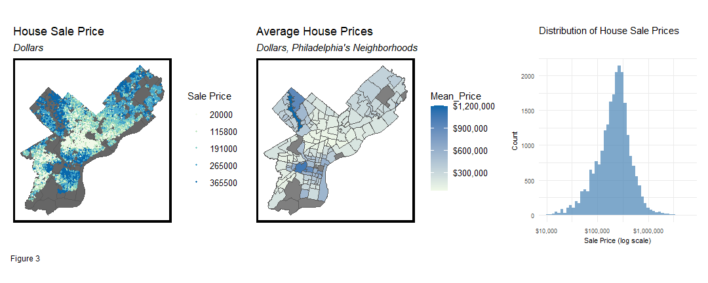

Finding an ideal housing is the main challenge when people decided to move to Philadelphia. A house with a lot of surrounding public amenities, safe neighborhood, and offer a lot of internal features will be desirable, but in what price? Navigating house prices in this city can be challenging, thus a price prediction tool will be helpful to give initial information to the buyer.

This project's objective is to create a tool to estimate a home's market value based on a valuation model that associate local intelligence factor in Philadelphia. This include house's internal characteristic. proximity to amenities and (dis)amenities, and trends into account.

 

Read more about it in the report below.
[View full report](../Report/Midterm_Resubmission_Jonathan_June.html){:target="_blank"}
