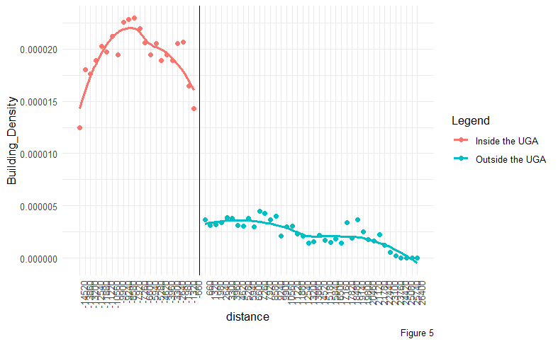

Urban sprawl has become one of the challenges for fast-growing metro areas in the United States. The expansion spread to the surrounding suburb to accommodate the living space for the city residents. This practice promotes car-dependent communities, increase in higher infrastructure costs, generates air and water pollution, and especially the loss of natural and agriculture land which tend to be unsustainable.

This project conducted Urban Growth Boundary analysis in Lancaster County to see the effect of the sprawl, and to identify and suggest the suitable towns for the current Urbang Growth Area expansion 

Read more about it in the report below.
[View full report](../Report/Lancaster County Development.html){:target="_blank"}
