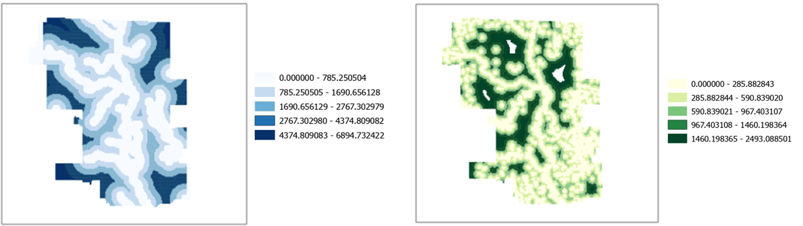

In preparation for the high precipitation season and to mitigate more loss, it is imperative to create a probability map to estimate flooding and inundation in a city. Data-driven probability maps will provide inundation-related information to help the city government to make data-based decisions. Inundation probability maps can be generated by creating prediction models, from some related variables that related spatially across space.

This project will build an inundation predictive model to predict areas of flood inundation in the city, by borrowing the experience from past inundation, associate the past event with related variables, and test the model’s validity on predicting the flood inundation event in the city of Calgary. The generated predictive model will be applied to predict flood inundation for a comparable city, in this case, Denver, Colorado, United States of America.

Read more about it in the report below.
[View full report](../Report/CPLN 675 ASSIGNMENT 03 JONATHAN_JUNE (1).pdf){:target="_blank"}
