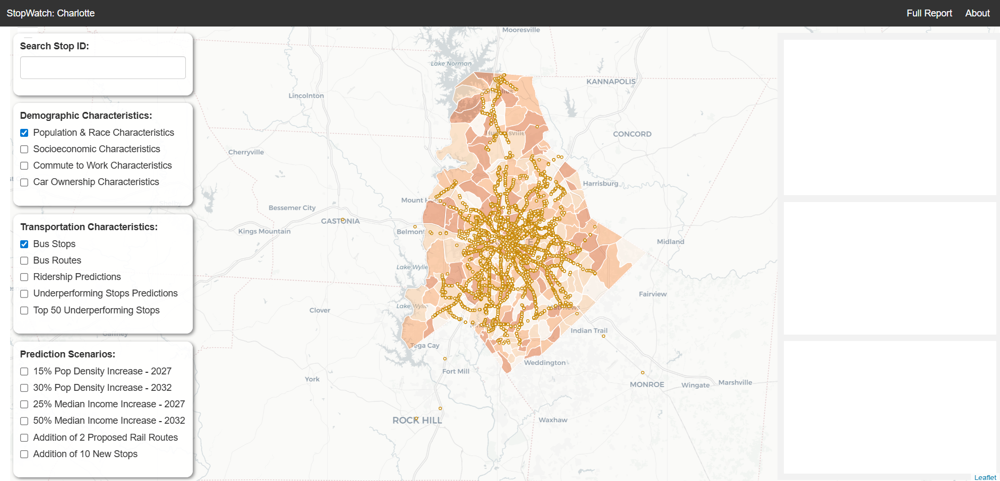

This project is a part of 8010 Master of Urban Spatial Analytics (MUSA)/Smart Cities Practicum Spring 2024 and in collaboration with Charlotte Area Transit System (CATS). We would like to give special thanks to our instructors Michael Fichman and Matthew Harris, also to Carlos Parada, Bruce Jones, and Jessica Odette from CATS for providing data, insight, and support over the course in the semester

This project will support CATS transportation planners in improving bus line efficiency by analyzing historical ridership trends per bus stop to identify and predict underperforming stops and routes. Our team want to understand the dynamics of the bus system then develop a model that forecast demand. Our team will model monthly bus demand by line and stop using APC data (boarding and alighting counts)

Read more about it in the report below.
[View full report](../Report/Combined_RMD.html){:target="_blank"}

To experience more about the analysis, please check out our project app.  
The project app contains a link to our website:  
👉 [Open the Project App]([https://your-app-link.com](https://roshiniganesh.shinyapps.io/MUSA-Charlotte-ShinyApp/))
