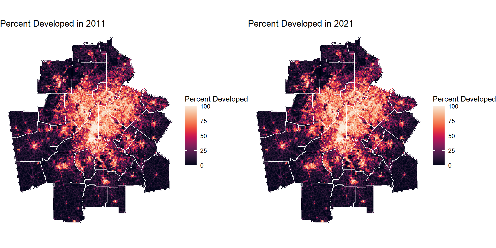

Atlanta is one of the fastest growing metropolitan areas in the United States. In 2011 the city’s Metropolitan Service Area (MSA) had a population of 4,544,000 people. By 2021 the population had increased to 5,911,000 people an increase of 30% in just ten years. By 2031 the population is forecasted to reach 6,662,000 people. This high population growth, has resulted in an increase in development. This development is necessary to provide homes for new residents, and additional commercial space to serve a growing population. However, urban development also creates a higher likelihood of urban sprawl, which can have detrimental impacts on the environment and result in biodiversity loss and increased storm water runoff.

[View poster](../Report/Urban Development Forecast.pdf){:target="_blank"}

This project developed a logistic regression model based on where development could take place between 2021 and 2031, which is used for forecasting land use change.

Urban Growth Boundary

Read more about it in the report below.
[View full report](../Report/CPLN_6750_HW5_RB_JM (1).html){:target="_blank"}

